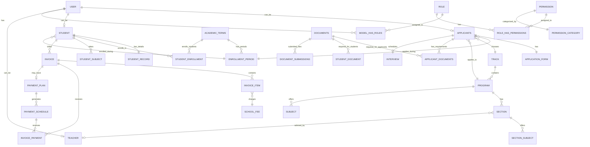

# Complete Entity Relationship Diagram (ERD)
## Dreamy School Management System

**Generated:** After comprehensive scan of all migrations and models  
**Total Entities:** 45+ (33 Models + 12 System Tables)  
**Last Updated:** December 2024

---

## Table of Contents

1. [High-Level ERD](#high-level-erd) - Conceptual overview
2. [Detailed ERD](#detailed-erd) - Complete physical structure
3. [Entity Group Breakdown](#entity-group-breakdown)
4. [Relationship Summary](#relationship-summary)

---

## High-Level ERD

### Overview Diagram (Conceptual)



---

## Detailed ERD

### Complete Physical Database Structure

```mermaid
erDiagram
    %% ============================================
    %% USER MANAGEMENT & AUTHENTICATION
    %% ============================================
    
    USERS ||--o| APPLICANTS : "user_id"
    USERS ||--o| STUDENTS : "user_id"
    USERS ||--o| TEACHERS : "user_id"
    USERS ||--o{ MODEL_HAS_ROLES : "polymorphic"
    USERS ||--o{ MODEL_HAS_PERMISSIONS : "polymorphic"
    USERS ||--o{ PERSONAL_ACCESS_TOKENS : "tokenable"
    USERS ||--o{ NOTIFICATIONS : "notifiable"
    USERS ||--o{ SESSIONS : "user_id"
    USERS ||--o{ PASSWORD_RESET_TOKENS : "email"
    USERS ||--o| USERS : "invited_by"
    
    USERS {
        bigint id PK
        string first_name
        string last_name
        string email UK
        timestamp email_verified_at
        string password
        string pin nullable
        boolean pin_enabled
        timestamp pin_setup_at
        string invitation_token UK nullable
        timestamp invitation_sent_at
        timestamp invitation_accepted_at
        string invitation_role nullable
        bigint invited_by FK nullable
        json invitation_data nullable
        string status
        string remember_token
        timestamps
    }
    
    SESSIONS {
        string id PK
        bigint user_id FK nullable
        string ip_address
        text user_agent
        longtext payload
        int last_activity
    }
    
    PASSWORD_RESET_TOKENS {
        string email PK
        string token
        timestamp created_at
    }
    
    PERSONAL_ACCESS_TOKENS {
        bigint id PK
        string tokenable_type
        bigint tokenable_id
        string name
        string token UK
        text abilities nullable
        timestamp last_used_at nullable
        timestamp expires_at nullable
        timestamps
    }
    
    NOTIFICATIONS {
        uuid id PK
        string type
        string notifiable_type
        bigint notifiable_id
        text data
        timestamp read_at nullable
        timestamps
    }
    
    %% ============================================
    %% ROLES & PERMISSIONS (Spatie)
    %% ============================================
    
    ROLES ||--o{ MODEL_HAS_ROLES : "role_id"
    ROLES ||--o{ ROLE_HAS_PERMISSIONS : "role_id"
    PERMISSIONS ||--o{ ROLE_HAS_PERMISSIONS : "permission_id"
    PERMISSIONS ||--o{ MODEL_HAS_PERMISSIONS : "permission_id"
    PERMISSIONS ||--|| PERMISSION_CATEGORIES : "permission_id"
    
    ROLES {
        bigint id PK
        string name UK
        string guard_name
        timestamps
    }
    
    PERMISSIONS {
        bigint id PK
        string name
        string guard_name
        string category nullable
        timestamps
        unique name_guard_name
    }
    
    PERMISSION_CATEGORIES {
        bigint id PK
        bigint permission_id FK UK
        string category_name
        text description
        timestamps
    }
    
    MODEL_HAS_ROLES {
        bigint role_id FK PK
        string model_type PK
        bigint model_id PK
    }
    
    MODEL_HAS_PERMISSIONS {
        bigint permission_id FK PK
        string model_type PK
        bigint model_id PK
    }
    
    ROLE_HAS_PERMISSIONS {
        bigint permission_id FK PK
        bigint role_id FK PK
    }
    
    %% ============================================
    %% ADMISSION PROCESS
    %% ============================================
    
    APPLICANTS ||--|| APPLICATION_FORMS : "applicants_id"
    APPLICANTS ||--o{ APPLICANT_DOCUMENTS : "applicants_id"
    APPLICANTS ||--o| INTERVIEWS : "applicants_id"
    APPLICANTS ||--o{ DOCUMENT_SUBMISSIONS : "polymorphic owner"
    APPLICANTS }o--|| ENROLLMENT_PERIODS : "enrollment_period_id"
    APPLICANTS }o--|| TRACKS : "track_id"
    APPLICANTS }o--|| PROGRAMS : "program_id"
    APPLICANTS }o--|| ACADEMIC_TERMS : "academic_terms_id"
    APPLICANTS }o--|| USERS : "user_id"
    
    APPLICANTS {
        bigint id PK
        bigint user_id FK nullable
        string applicant_id UK
        bigint enrollment_period_id FK nullable
        bigint track_id FK nullable
        bigint program_id FK nullable
        bigint academic_terms_id FK nullable
        string first_name
        string last_name
        string application_status
        timestamp accepted_at nullable
        bigint accepted_by FK nullable
        text rejection_reason nullable
        text rejection_remarks nullable
        timestamp rejected_at nullable
        bigint rejected_by FK nullable
        timestamps
    }
    
    APPLICATION_FORMS {
        bigint id PK
        bigint academic_terms_id FK nullable
        bigint enrollment_period_id FK nullable
        bigint applicants_id FK
        string lrn nullable
        string grade_level
        string acad_term_applied nullable
        string semester_applied nullable
        timestamp admission_date nullable
        string last_name
        string first_name
        string middle_name nullable
        string extension_name nullable
        string gender
        date birthdate
        int age
        string place_of_birth nullable
        string mother_tongue nullable
        boolean belongs_to_ip
        boolean is_4ps_beneficiary
        string contact_number
        string cur_house_no nullable
        string cur_street nullable
        string cur_barangay nullable
        string cur_city nullable
        string cur_province nullable
        string cur_country nullable
        string cur_zip_code nullable
        string perm_house_no nullable
        string perm_street nullable
        string perm_barangay nullable
        string perm_city nullable
        string perm_province nullable
        string perm_country nullable
        string perm_zip_code nullable
        string father_last_name nullable
        string father_first_name nullable
        string father_middle_name nullable
        string father_contact_number nullable
        string mother_last_name nullable
        string mother_first_name nullable
        string mother_middle_name nullable
        string mother_contact_number nullable
        string guardian_last_name nullable
        string guardian_first_name nullable
        string guardian_middle_name nullable
        string guardian_contact_number nullable
        boolean has_special_needs
        json special_needs nullable
        string last_grade_level_completed nullable
        string last_school_attended nullable
        date last_school_year_completed nullable
        string school_id nullable
        string preferred_sched nullable
        boolean is_returning
        timestamps
    }
    
    INTERVIEWS {
        bigint id PK
        bigint applicants_id FK
        bigint teacher_id FK nullable
        date date
        time time
        string location nullable
        text add_info nullable
        string status
        text remarks nullable
        bigint recorded_by FK nullable
        timestamp recorded_at nullable
        timestamps
    }
    
    APPLICANT_DOCUMENTS {
        bigint id PK
        bigint applicants_id FK
        bigint documents_id FK
        date submit_before nullable
        string status
        timestamps
    }
    
    %% ============================================
    %% ACADEMIC STRUCTURE
    %% ============================================
    
    ACADEMIC_TERMS ||--o{ ENROLLMENT_PERIODS : "academic_terms_id"
    ACADEMIC_TERMS ||--o{ STUDENT_ENROLLMENTS : "academic_term_id"
    ACADEMIC_TERMS ||--o{ APPLICATION_FORMS : "academic_terms_id"
    ACADEMIC_TERMS ||--o{ SCHOOL_FEES : "academic_term_id"
    ACADEMIC_TERMS ||--o{ INVOICES : "academic_term_id"
    ACADEMIC_TERMS ||--o{ INVOICE_ITEMS : "academic_term_id"
    ACADEMIC_TERMS ||--o{ INVOICE_PAYMENTS : "academic_term_id"
    ACADEMIC_TERMS ||--o{ DOCUMENT_SUBMISSIONS : "academic_terms_id"
    
    ACADEMIC_TERMS {
        bigint id PK
        string year
        string semester
        date start_date
        date end_date
        boolean is_active
        timestamps
    }
    
    ENROLLMENT_PERIODS ||--o{ APPLICANTS : "enrollment_period_id"
    ENROLLMENT_PERIODS ||--o{ APPLICATION_FORMS : "enrollment_period_id"
    ENROLLMENT_PERIODS ||--o{ DOCUMENT_SUBMISSIONS : "enrollment_period_id"
    ENROLLMENT_PERIODS }o--|| ACADEMIC_TERMS : "academic_terms_id"
    
    ENROLLMENT_PERIODS {
        bigint id PK
        bigint academic_terms_id FK
        string name
        date application_start_date
        date application_end_date
        int max_applicants nullable
        string status
        boolean active
        string period_type nullable
        decimal early_discount_percentage nullable
        timestamps
    }
    
    TRACKS ||--o{ PROGRAMS : "track_id"
    TRACKS ||--o{ APPLICANTS : "track_id"
    
    TRACKS {
        bigint id PK
        string name
        string code nullable
        text description nullable
        string status nullable
        timestamps
    }
    
    PROGRAMS ||--o{ SECTIONS : "program_id"
    PROGRAMS ||--o{ SUBJECTS : "program_id"
    PROGRAMS ||--o{ STUDENTS : "program_id"
    PROGRAMS ||--o{ SCHOOL_FEES : "program_id"
    PROGRAMS ||--o{ APPLICANTS : "program_id"
    PROGRAMS ||--o{ TEACHERS : "program_id"
    PROGRAMS ||--o{ STUDENT_ENROLLMENTS : "program_id"
    PROGRAMS }o--|| TRACKS : "track_id"
    
    PROGRAMS {
        bigint id PK
        string code
        string name
        string track nullable
        bigint track_id FK nullable
        string status nullable
        timestamps
    }
    
    SECTIONS ||--o{ STUDENTS : "section_id"
    SECTIONS ||--o{ SECTION_SUBJECTS : "section_id"
    SECTIONS ||--o{ STUDENT_ENROLLMENTS : "section_id"
    SECTIONS }o--|| PROGRAMS : "program_id"
    SECTIONS }o--o| TEACHERS : "teacher_id"
    
    SECTIONS {
        bigint id PK
        string name
        bigint program_id FK
        bigint teacher_id FK nullable
        string year_level
        string room nullable
        int total_enrolled_students
        timestamps
    }
    
    SUBJECTS ||--o{ SECTION_SUBJECTS : "subject_id"
    SUBJECTS }o--|| PROGRAMS : "program_id"
    
    SUBJECTS {
        bigint id PK
        string name
        bigint program_id FK nullable
        string grade_level
        string category
        string semester
        timestamps
    }
    
    SECTION_SUBJECTS ||--o{ STUDENT_SUBJECTS : "section_subject_id"
    SECTION_SUBJECTS }o--|| SECTIONS : "section_id"
    SECTION_SUBJECTS }o--|| SUBJECTS : "subject_id"
    SECTION_SUBJECTS }o--o| TEACHERS : "teacher_id"
    
    SECTION_SUBJECTS {
        bigint id PK
        bigint section_id FK
        bigint subject_id FK
        bigint teacher_id FK nullable
        string room nullable
        json days_of_week nullable
        time start_time nullable
        time end_time nullable
        timestamps
    }
    
    %% ============================================
    %% STUDENT MANAGEMENT
    %% ============================================
    
    STUDENTS ||--|| STUDENT_RECORDS : "student_id"
    STUDENTS ||--o{ STUDENT_ENROLLMENTS : "student_id"
    STUDENTS ||--o{ STUDENT_SUBJECTS : "student_id"
    STUDENTS ||--o{ STUDENT_DOCUMENTS : "student_id"
    STUDENTS ||--o{ INVOICES : "student_id"
    STUDENTS ||--o{ DOCUMENT_SUBMISSIONS : "polymorphic owner"
    STUDENTS }o--|| USERS : "user_id"
    STUDENTS }o--|| ENROLLMENT_PERIODS : "enrollment_period_id"
    STUDENTS }o--|| TRACKS : "track_id"
    STUDENTS }o--|| PROGRAMS : "program_id"
    STUDENTS }o--o| SECTIONS : "section_id"
    
    STUDENTS {
        bigint id PK
        bigint user_id FK
        bigint enrollment_period_id FK nullable
        bigint track_id FK nullable
        bigint program_id FK nullable
        bigint section_id FK nullable
        string section nullable
        string lrn UK nullable
        string grade_level
        string academic_status
        date enrollment_date
        string status
        timestamps
    }
    
    STUDENT_RECORDS {
        bigint id PK
        bigint student_id FK UK
        string middle_name nullable
        string extension_name nullable
        date birthdate
        string gender
        int age
        string place_of_birth nullable
        string mother_tongue nullable
        string contact_number nullable
        text current_address nullable
        text permanent_address nullable
        string house_no nullable
        string street nullable
        string barangay nullable
        string city nullable
        string province nullable
        string country nullable
        string zip_code nullable
        text father_name nullable
        string father_contact_number nullable
        text mother_name nullable
        string mother_contact_number nullable
        text guardian_name nullable
        string guardian_contact_number nullable
        string last_school_attended nullable
        string last_grade_level_completed nullable
        string school_id nullable
        string acad_term_applied nullable
        string semester_applied nullable
        date admission_date nullable
        boolean has_special_needs
        json special_needs nullable
        boolean belongs_to_ip
        boolean is_4ps_beneficiary
        string academic_status nullable
        timestamps
    }
    
    STUDENT_ENROLLMENTS {
        bigint id PK
        bigint student_id FK
        bigint academic_term_id FK
        bigint program_id FK
        bigint section_id FK nullable
        string status
        timestamp enrolled_at
        timestamp confirmed_at nullable
        json meta nullable
        timestamps
    }
    
    STUDENT_SUBJECTS {
        bigint id PK
        bigint student_id FK
        bigint section_subject_id FK
        string status
        timestamps
    }
    
    TEACHERS ||--o{ SECTIONS : "teacher_id"
    TEACHERS ||--o{ SECTION_SUBJECTS : "teacher_id"
    TEACHERS ||--o{ INTERVIEWS : "teacher_id"
    TEACHERS }o--|| USERS : "user_id"
    TEACHERS }o--|| PROGRAMS : "program_id"
    
    TEACHERS {
        bigint id PK
        bigint user_id FK
        bigint program_id FK nullable
        bigint section_id FK nullable
        string employee_id nullable
        string first_name nullable
        string last_name nullable
        string email_address nullable
        string contact_number nullable
        string specialization nullable
        string status nullable
        timestamps
    }
    
    %% ============================================
    %% FINANCIAL SYSTEM
    %% ============================================
    
    INVOICES ||--o{ INVOICE_ITEMS : "invoice_id"
    INVOICES ||--o{ INVOICE_PAYMENTS : "invoice_id"
    INVOICES ||--o| PAYMENT_PLANS : "invoice_id"
    INVOICES ||--o{ PAYMENT_SCHEDULES : "invoice_id"
    INVOICES }o--|| STUDENTS : "student_id"
    INVOICES }o--|| ACADEMIC_TERMS : "academic_term_id"
    
    INVOICES {
        bigint id PK
        bigint student_id FK
        bigint academic_term_id FK
        string invoice_number UK
        string status
        boolean has_payment_plan
        string payment_mode nullable
        timestamp deleted_at nullable
        timestamps
    }
    
    INVOICE_ITEMS {
        bigint id PK
        bigint invoice_id FK
        bigint school_fee_id FK
        decimal amount
        bigint academic_term_id FK
        timestamps
    }
    
    INVOICE_PAYMENTS {
        bigint id PK
        bigint invoice_id FK
        bigint payment_schedule_id FK nullable
        decimal amount
        decimal original_amount
        decimal early_discount nullable
        decimal custom_discounts nullable
        decimal total_discount nullable
        date payment_date
        string method
        string type
        string reference_no nullable
        bigint academic_term_id FK
        timestamps
    }
    
    SCHOOL_FEES ||--o{ INVOICE_ITEMS : "school_fee_id"
    SCHOOL_FEES }o--|| PROGRAMS : "program_id"
    SCHOOL_FEES }o--|| ACADEMIC_TERMS : "academic_term_id"
    
    SCHOOL_FEES {
        bigint id PK
        string name
        decimal amount
        bigint program_id FK nullable
        string grade_level nullable
        bigint academic_term_id FK nullable
        timestamps
    }
    
    PAYMENT_PLANS ||--o{ PAYMENT_SCHEDULES : "payment_plan_id"
    PAYMENT_PLANS }o--|| INVOICES : "invoice_id"
    
    PAYMENT_PLANS {
        bigint id PK
        bigint invoice_id FK UK
        decimal total_amount
        decimal discounted_total nullable
        decimal total_discount nullable
        decimal down_payment_amount
        decimal remaining_amount
        int installment_months
        decimal monthly_amount
        decimal first_month_amount
        string payment_type
        timestamps
    }
    
    PAYMENT_SCHEDULES ||--o{ INVOICE_PAYMENTS : "payment_schedule_id"
    PAYMENT_SCHEDULES }o--|| PAYMENT_PLANS : "payment_plan_id"
    PAYMENT_SCHEDULES }o--|| INVOICES : "invoice_id"
    
    PAYMENT_SCHEDULES {
        bigint id PK
        bigint payment_plan_id FK nullable
        bigint invoice_id FK
        int installment_number
        decimal amount_due
        decimal amount_paid
        date due_date nullable
        string status
        text description nullable
        timestamps
    }
    
    DISCOUNTS {
        bigint id PK
        string name
        text description nullable
        string discount_type
        decimal discount_value
        boolean is_active
        timestamps
    }
    
    %% ============================================
    %% DOCUMENT MANAGEMENT
    %% ============================================
    
    DOCUMENTS ||--o{ APPLICANT_DOCUMENTS : "documents_id"
    DOCUMENTS ||--o{ STUDENT_DOCUMENTS : "documents_id"
    DOCUMENTS ||--o{ DOCUMENT_SUBMISSIONS : "documents_id"
    
    DOCUMENTS {
        bigint id PK
        string type
        text description nullable
        json file_type_restriction nullable
        int max_file_size nullable
        timestamps
    }
    
    STUDENT_DOCUMENTS {
        bigint id PK
        bigint student_id FK
        bigint documents_id FK
        date submit_before nullable
        string status
        timestamps
    }
    
    DOCUMENT_SUBMISSIONS {
        bigint id PK
        string owner_type
        bigint owner_id
        bigint academic_terms_id FK
        bigint enrollment_period_id FK
        bigint documents_id FK
        bigint applicants_id FK nullable
        string file_path nullable
        timestamp submitted_at
        timestamps
    }
    
    %% ============================================
    %% SYSTEM CONFIGURATION
    %% ============================================
    
    SCHOOL_SETTINGS {
        bigint id PK
        string name
        string short_name nullable
        string address_line1 nullable
        string address_line2 nullable
        string city nullable
        string province nullable
        string country nullable
        string zip nullable
        string phone nullable
        string email nullable
        string website nullable
        string registrar_name nullable
        string registrar_title nullable
        string logo_path nullable
        decimal down_payment nullable
        int due_day_of_month nullable
        boolean use_last_day_if_shorter nullable
        timestamps
    }
    
    NEWS {
        bigint id PK
        string title
        text content
        string status
        string visibility
        boolean is_announcement
        timestamp published_at nullable
        timestamps
    }
    
    WEB_BACKGROUNDS {
        bigint id PK
        string key UK
        text value
        timestamps
    }
    
    INVOICE_TEMPLATES {
        bigint id PK
        timestamps
    }
    
    %% ============================================
    %% ACTIVITY LOG
    %% ============================================
    
    ACTIVITY_LOG {
        bigint id PK
        string log_name nullable
        text description
        string subject_type nullable
        bigint subject_id nullable
        string causer_type nullable
        bigint causer_id nullable
        string event nullable
        json properties nullable
        uuid batch_uuid nullable
        timestamps
    }
    
    %% ============================================
    %% LARAVEL SYSTEM TABLES
    %% ============================================
    
    CACHE {
        string key PK
        mediumtext value
        int expiration
    }
    
    CACHE_LOCKS {
        string key PK
        string owner
        int expiration
    }
    
    JOBS {
        bigint id PK
        string queue
        longtext payload
        tinyint attempts
        int reserved_at nullable
        int available_at
        int created_at
    }
    
    JOB_BATCHES {
        string id PK
        string name
        int total_jobs
        int pending_jobs
        int failed_jobs
        longtext failed_job_ids
        mediumtext options nullable
        int cancelled_at nullable
        int created_at
        int finished_at nullable
    }
    
    FAILED_JOBS {
        bigint id PK
        string uuid UK
        text connection
        text queue
        longtext payload
        longtext exception
        timestamp failed_at
    }
```

---

## Entity Group Breakdown

### 1. **User Management & Authentication** (10 tables)
- `users` - Core user accounts
- `sessions` - User sessions
- `password_reset_tokens` - Password reset
- `personal_access_tokens` - API authentication (Sanctum)
- `notifications` - Laravel notifications
- `roles` - Spatie roles
- `permissions` - Spatie permissions
- `permission_categories` - Permission organization
- `model_has_roles` - User-role assignments
- `model_has_permissions` - Direct user permissions
- `role_has_permissions` - Role-permission assignments

### 2. **Admission Process** (4 tables)
- `applicants` - Applicant records
- `application_forms` - Detailed application data
- `interviews` - Interview scheduling
- `applicants_documents` - Document requirements for applicants

### 3. **Academic Structure** (8 tables)
- `academic_terms` - School years/semesters
- `enrollment_periods` - Enrollment windows
- `tracks` - Academic tracks (STEM, ABM, etc.)
- `programs` - Programs within tracks
- `sections` - Classes/sections
- `subjects` - Course subjects
- `section_subjects` - Subject offerings with schedules
- `teachers` - Faculty/teachers

### 4. **Student Management** (5 tables)
- `students` - Student records
- `student_records` - Detailed student information
- `student_enrollments` - Enrollment history per term
- `student_subjects` - Student subject enrollments
- `student_documents` - Document requirements for students

### 5. **Financial System** (7 tables)
- `school_fees` - Fee definitions
- `invoices` - Student billing
- `invoice_items` - Invoice line items
- `invoice_payments` - Payment records
- `payment_plans` - Installment plans
- `payment_schedules` - Payment schedule details
- `discounts` - Discount configurations

### 6. **Document Management** (3 tables)
- `documents` - Document type definitions
- `student_documents` - Student document requirements
- `document_submissions` - Actual document uploads (polymorphic)

### 7. **System Configuration** (4 tables)
- `school_settings` - School-wide settings
- `news` - News and announcements
- `web_backgrounds` - Website configuration (key-value)
- `invoice_templates` - Invoice templates

### 8. **Activity & Logging** (1 table)
- `activity_log` - System activity logging (Spatie Activity Log)

### 9. **Laravel System Tables** (5 tables)
- `cache` - Application cache
- `cache_locks` - Cache locks
- `jobs` - Queue jobs
- `job_batches` - Job batching
- `failed_jobs` - Failed job records

**Total: 47 Tables**

---

## Relationship Summary

### One-to-One Relationships
- User ↔ Applicants (optional)
- User ↔ Student (optional)
- User ↔ Teacher (optional)
- Applicants ↔ ApplicationForm
- Applicants ↔ Interview (optional)
- Student ↔ StudentRecord
- Invoice ↔ PaymentPlan (optional)
- Permission ↔ PermissionCategory

### One-to-Many Relationships
- User → Users (invited_by)
- AcademicTerms → EnrollmentPeriods
- AcademicTerms → StudentEnrollments
- AcademicTerms → ApplicationForms
- AcademicTerms → SchoolFees
- AcademicTerms → Invoices
- EnrollmentPeriods → Applicants
- EnrollmentPeriods → ApplicationForms
- Tracks → Programs
- Programs → Sections
- Programs → Subjects
- Programs → Students
- Programs → SchoolFees
- Programs → Applicants
- Programs → Teachers
- Sections → Students
- Sections → SectionSubjects
- Sections → StudentEnrollments
- Subjects → SectionSubjects
- SectionSubjects → StudentSubjects
- Teachers → Sections (as adviser)
- Teachers → SectionSubjects (as instructor)
- Students → StudentEnrollments
- Students → StudentSubjects
- Students → Invoices
- Students → StudentDocuments
- Invoices → InvoiceItems
- Invoices → InvoicePayments
- Invoices → PaymentSchedules
- PaymentPlans → PaymentSchedules
- PaymentSchedules → InvoicePayments
- SchoolFees → InvoiceItems
- Documents → ApplicantDocuments
- Documents → StudentDocuments
- Documents → DocumentSubmissions

### Many-to-Many Relationships
- User ↔ Roles (through model_has_roles)
- User ↔ Permissions (through model_has_permissions)
- Role ↔ Permissions (through role_has_permissions)
- Student ↔ SectionSubjects (through student_subjects)

### Polymorphic Relationships
- DocumentSubmissions (owner: Applicants OR Students)
- PersonalAccessTokens (tokenable: any model)
- Notifications (notifiable: any model)
- ModelHasRoles (model: any model)
- ModelHasPermissions (model: any model)
- ActivityLog (subject, causer: any model)

---

## Key Indexes & Constraints

### Primary Keys
All tables have `id` as primary key except:
- `model_has_roles` - Composite PK (role_id, model_id, model_type)
- `model_has_permissions` - Composite PK (permission_id, model_id, model_type)
- `role_has_permissions` - Composite PK (permission_id, role_id)
- `password_reset_tokens` - PK on email
- `sessions` - PK on id (string)
- `cache` - PK on key (string)
- `cache_locks` - PK on key (string)
- `job_batches` - PK on id (string)
- `notifications` - PK on id (uuid)

### Unique Constraints
- `users.email`
- `users.invitation_token`
- `applicants.applicant_id`
- `students.lrn`
- `invoices.invoice_number`
- `payment_plans.invoice_id`
- `permissions` (name, guard_name)
- `roles` (name, guard_name)
- `permission_categories.permission_id`
- `web_backgrounds.key`

### Foreign Key Constraints
All foreign keys are documented in the detailed ERD above. Key relationships:
- Cascading deletes where appropriate
- Set null for optional relationships
- Composite foreign keys for polymorphic relationships

### Soft Deletes
- `invoices` - Uses `deleted_at` timestamp

---

## Database Statistics

- **Total Tables:** 47
- **Core Business Tables:** 33
- **System Tables:** 12
- **Laravel Framework Tables:** 8
- **Spatie Package Tables:** 6
- **Custom Tables:** 33

---

**Generated:** December 2024  
**System:** Dreamy School Management System  
**Database:** MySQL/MariaDB/SQLite (Laravel supported)


