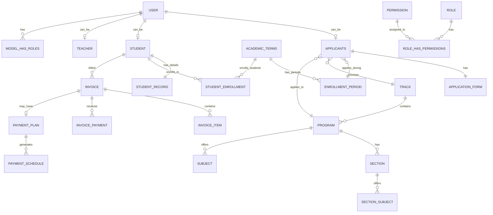
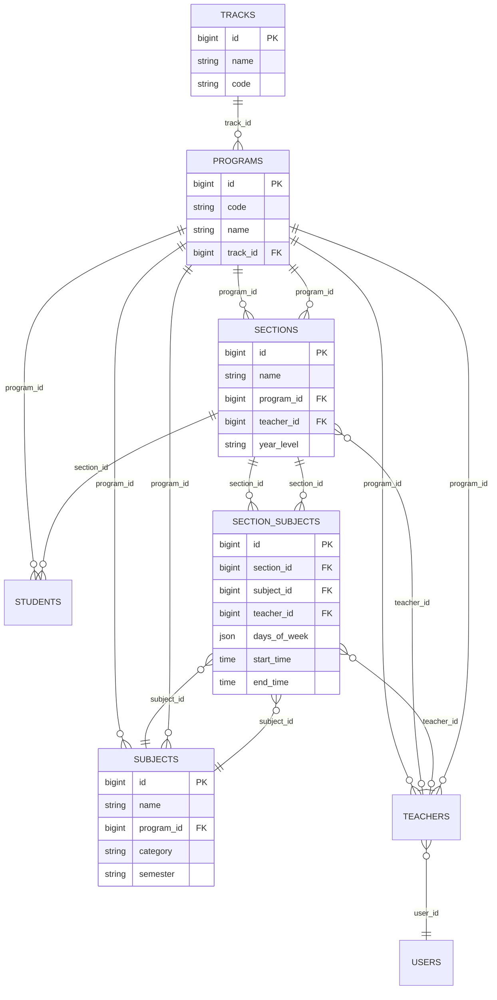
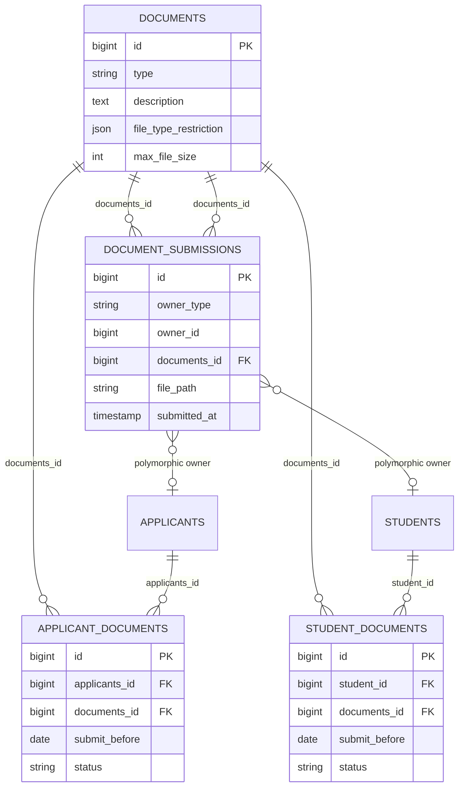

# Entity Relationship Diagrams - Visual Edition

## How to View These Diagrams

1. **Copy the Mermaid code below**
2. **Paste into:** https://mermaid.live/
3. **Click "Actions" → "Download PNG"** to save as image
4. **Or use VS Code** with Mermaid Preview extension

---

## High-Level ERD (Conceptual Overview)



---

## Detailed ERD - Core Business Entities

```mermaid
erDiagram
    USERS ||--o| APPLICANTS : "user_id"
    USERS ||--o| STUDENTS : "user_id"
    USERS ||--o| TEACHERS : "user_id"
    
    APPLICANTS ||--|| APPLICATION_FORMS : "applicants_id"
    APPLICANTS }o--|| ENROLLMENT_PERIODS : "enrollment_period_id"
    APPLICANTS }o--|| PROGRAMS : "program_id"
    APPLICANTS ||--o{ APPLICANT_DOCUMENTS : "applicants_id"
    APPLICANTS ||--o| INTERVIEWS : "applicants_id"
    
    ACADEMIC_TERMS ||--o{ ENROLLMENT_PERIODS : "academic_terms_id"
    ACADEMIC_TERMS ||--o{ STUDENT_ENROLLMENTS : "academic_term_id"
    ACADEMIC_TERMS ||--o{ INVOICES : "academic_term_id"
    
    TRACKS ||--o{ PROGRAMS : "track_id"
    PROGRAMS ||--o{ SECTIONS : "program_id"
    PROGRAMS ||--o{ SUBJECTS : "program_id"
    PROGRAMS ||--o{ STUDENTS : "program_id"
    PROGRAMS ||--o{ SCHOOL_FEES : "program_id"
    
    SECTIONS }o--|| PROGRAMS : "program_id"
    SECTIONS }o--o| TEACHERS : "teacher_id"
    SECTIONS ||--o{ SECTION_SUBJECTS : "section_id"
    SECTIONS ||--o{ STUDENTS : "section_id"
    
    SUBJECTS }o--|| PROGRAMS : "program_id"
    SUBJECTS ||--o{ SECTION_SUBJECTS : "subject_id"
    
    SECTION_SUBJECTS }o--|| SECTIONS : "section_id"
    SECTION_SUBJECTS }o--|| SUBJECTS : "subject_id"
    SECTION_SUBJECTS }o--o| TEACHERS : "teacher_id"
    SECTION_SUBJECTS ||--o{ STUDENT_SUBJECTS : "section_subject_id"
    
    STUDENTS ||--|| STUDENT_RECORDS : "student_id"
    STUDENTS ||--o{ STUDENT_ENROLLMENTS : "student_id"
    STUDENTS ||--o{ STUDENT_SUBJECTS : "student_id"
    STUDENTS ||--o{ INVOICES : "student_id"
    STUDENTS ||--o{ STUDENT_DOCUMENTS : "student_id"
    
    STUDENT_ENROLLMENTS }o--|| STUDENTS : "student_id"
    STUDENT_ENROLLMENTS }o--|| ACADEMIC_TERMS : "academic_term_id"
    STUDENT_ENROLLMENTS }o--|| PROGRAMS : "program_id"
    STUDENT_ENROLLMENTS }o--o| SECTIONS : "section_id"
    
    INVOICES ||--o{ INVOICE_ITEMS : "invoice_id"
    INVOICES ||--o{ INVOICE_PAYMENTS : "invoice_id"
    INVOICES ||--o| PAYMENT_PLANS : "invoice_id"
    INVOICES ||--o{ PAYMENT_SCHEDULES : "invoice_id"
    
    INVOICE_ITEMS }o--|| INVOICES : "invoice_id"
    INVOICE_ITEMS }o--|| SCHOOL_FEES : "school_fee_id"
    
    INVOICE_PAYMENTS }o--|| INVOICES : "invoice_id"
    INVOICE_PAYMENTS }o--o| PAYMENT_SCHEDULES : "payment_schedule_id"
    
    PAYMENT_PLANS ||--o{ PAYMENT_SCHEDULES : "payment_plan_id"
    
    PAYMENT_SCHEDULES }o--|| PAYMENT_PLANS : "payment_plan_id"
    PAYMENT_SCHEDULES }o--|| INVOICES : "invoice_id"
    PAYMENT_SCHEDULES ||--o{ INVOICE_PAYMENTS : "payment_schedule_id"
    
    SCHOOL_FEES }o--|| PROGRAMS : "program_id"
    SCHOOL_FEES }o--|| ACADEMIC_TERMS : "academic_term_id"
    SCHOOL_FEES ||--o{ INVOICE_ITEMS : "school_fee_id"
    
    DOCUMENTS ||--o{ APPLICANT_DOCUMENTS : "documents_id"
    DOCUMENTS ||--o{ STUDENT_DOCUMENTS : "documents_id"
    
    USERS {
        bigint id PK
        string first_name
        string last_name
        string email UK
        string password
        string status
    }
    
    APPLICANTS {
        bigint id PK
        bigint user_id FK
        string applicant_id UK
        bigint enrollment_period_id FK
        bigint program_id FK
        string application_status
    }
    
    STUDENTS {
        bigint id PK
        bigint user_id FK
        string lrn UK
        bigint program_id FK
        bigint section_id FK
        string grade_level
    }
    
    ACADEMIC_TERMS {
        bigint id PK
        string year
        string semester
        boolean is_active
    }
    
    ENROLLMENT_PERIODS {
        bigint id PK
        bigint academic_terms_id FK
        string name
        string status
    }
    
    PROGRAMS {
        bigint id PK
        string code
        string name
        bigint track_id FK
    }
    
    SECTIONS {
        bigint id PK
        string name
        bigint program_id FK
        bigint teacher_id FK
    }
    
    INVOICES {
        bigint id PK
        bigint student_id FK
        string invoice_number UK
        string status
    }
    
    PAYMENT_PLANS {
        bigint id PK
        bigint invoice_id FK UK
        decimal total_amount
        int installment_months
    }
```

---

## Permission System ERD

```mermaid
erDiagram
    USERS ||--o{ MODEL_HAS_ROLES : "polymorphic"
    ROLES ||--o{ MODEL_HAS_ROLES : "role_id"
    ROLES ||--o{ ROLE_HAS_PERMISSIONS : "role_id"
    PERMISSIONS ||--o{ ROLE_HAS_PERMISSIONS : "permission_id"
    PERMISSIONS ||--o{ MODEL_HAS_PERMISSIONS : "permission_id"
    PERMISSIONS ||--|| PERMISSION_CATEGORIES : "permission_id"
    
    ROLES {
        bigint id PK
        string name UK
        string guard_name
    }
    
    PERMISSIONS {
        bigint id PK
        string name
        string guard_name
    }
    
    MODEL_HAS_ROLES {
        bigint role_id FK PK
        string model_type PK
        bigint model_id PK
    }
    
    ROLE_HAS_PERMISSIONS {
        bigint permission_id FK PK
        bigint role_id FK PK
    }
```

---

## Financial System ERD

```mermaid
erDiagram
    STUDENTS ||--o{ INVOICES : "student_id"
    INVOICES ||--o{ INVOICE_ITEMS : "invoice_id"
    INVOICES ||--o{ INVOICE_PAYMENTS : "invoice_id"
    INVOICES ||--o| PAYMENT_PLANS : "invoice_id"
    INVOICES ||--o{ PAYMENT_SCHEDULES : "invoice_id"
    
    SCHOOL_FEES ||--o{ INVOICE_ITEMS : "school_fee_id"
    PAYMENT_PLANS ||--o{ PAYMENT_SCHEDULES : "payment_plan_id"
    PAYMENT_SCHEDULES ||--o{ INVOICE_PAYMENTS : "payment_schedule_id"
    
    ACADEMIC_TERMS ||--o{ INVOICES : "academic_term_id"
    ACADEMIC_TERMS ||--o{ SCHOOL_FEES : "academic_term_id"
    
    INVOICES {
        bigint id PK
        bigint student_id FK
        bigint academic_term_id FK
        string invoice_number UK
        string status
        boolean has_payment_plan
    }
    
    INVOICE_ITEMS {
        bigint id PK
        bigint invoice_id FK
        bigint school_fee_id FK
        decimal amount
    }
    
    INVOICE_PAYMENTS {
        bigint id PK
        bigint invoice_id FK
        bigint payment_schedule_id FK
        decimal amount
        string method
    }
    
    PAYMENT_PLANS {
        bigint id PK
        bigint invoice_id FK UK
        decimal total_amount
        decimal discounted_total
        int installment_months
    }
    
    PAYMENT_SCHEDULES {
        bigint id PK
        bigint payment_plan_id FK
        bigint invoice_id FK
        int installment_number
        decimal amount_due
        string status
    }
    
    SCHOOL_FEES {
        bigint id PK
        string name
        decimal amount
        bigint program_id FK
        bigint academic_term_id FK
    }
```

---

## Academic Structure ERD



---

## Student Management ERD

```mermaid
erDiagram
    USERS ||--|| STUDENTS : "user_id"
    STUDENTS ||--|| STUDENT_RECORDS : "student_id"
    STUDENTS ||--o{ STUDENT_ENROLLMENTS : "student_id"
    STUDENTS ||--o{ STUDENT_SUBJECTS : "student_id"
    STUDENTS ||--o{ STUDENT_DOCUMENTS : "student_id"
    STUDENTS ||--o{ INVOICES : "student_id"
    
    STUDENT_ENROLLMENTS }o--|| STUDENTS : "student_id"
    STUDENT_ENROLLMENTS }o--|| ACADEMIC_TERMS : "academic_term_id"
    STUDENT_ENROLLMENTS }o--|| PROGRAMS : "program_id"
    STUDENT_ENROLLMENTS }o--o| SECTIONS : "section_id"
    
    STUDENT_SUBJECTS }o--|| STUDENTS : "student_id"
    STUDENT_SUBJECTS }o--|| SECTION_SUBJECTS : "section_subject_id"
    
    STUDENT_DOCUMENTS }o--|| STUDENTS : "student_id"
    STUDENT_DOCUMENTS }o--|| DOCUMENTS : "documents_id"
    
    STUDENTS {
        bigint id PK
        bigint user_id FK
        string lrn UK
        bigint program_id FK
        bigint section_id FK
        string grade_level
        string academic_status
    }
    
    STUDENT_RECORDS {
        bigint id PK
        bigint student_id FK UK
        date birthdate
        string gender
        text address
        text parent_info
    }
    
    STUDENT_ENROLLMENTS {
        bigint id PK
        bigint student_id FK
        bigint academic_term_id FK
        bigint program_id FK
        bigint section_id FK
        string status
    }
    
    STUDENT_SUBJECTS {
        bigint id PK
        bigint student_id FK
        bigint section_subject_id FK
        string status
    }
```

---

## Document Management ERD



---

## Quick Export Instructions

### Option 1: Mermaid Live Editor (Recommended)
1. Go to: https://mermaid.live/
2. Paste any diagram code above
3. Click **"Actions"** → **"Download PNG"** or **"Download SVG"**
4. Save the image file

### Option 2: VS Code
1. Install **"Markdown Preview Mermaid Support"** extension
2. Open this `.md` file
3. Right-click → **"Open Preview"**
4. Right-click on diagram → **"Save Image As"**

### Option 3: Online Tools
- **Mermaid.ink** - Generates PNG from Mermaid code
- **Kroki.io** - Multiple diagram formats
- **Draw.io** - Import Mermaid code

---

**Total Diagrams:** 7 separate ERDs covering all aspects of the system


